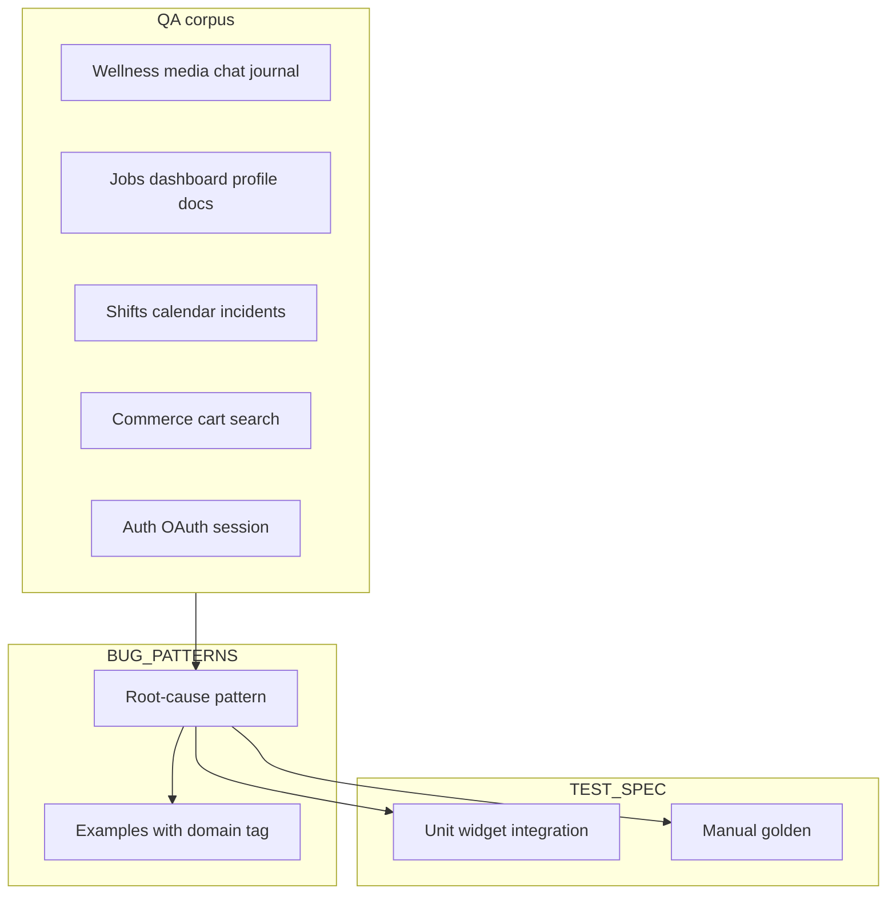

# BUG_PATTERNS.md expansion — v2 (full corpus analysis)

## What changed from v1

You supplied **additional products/flows**: audio player ↔ notification sync, companion/journal/chat, job dashboard (applications, filters, documents), shift scheduling (calendar, keyboard, reports), plus the earlier **community/e‑commerce** list. The v1 plan’s **PATTERN-011–030** mapping stays valid for commerce-heavy bullets; v2 **merges duplicate themes** (e.g. “Google/Apple auth” appears in wellness and jobs) and adds **new root-cause buckets** for media, jobs, and enterprise shift flows.

## Registry strategy (best practices)

1. **One pattern = one failure mode + prevention**, not one Jira line.
2. **`Examples:`** bullets carry traceability: short symptom + optional `(Domain: Wellness|Jobs|…)` so unrelated apps share one pattern id.
3. **Multi-product corpus**: do **not** fork `BUG_PATTERNS.md` per app unless required; use Examples for domain. Optional second file `BUG_PATTERNS_JOBS.md` only if legal/team boundaries demand it.
4. **`[Not sure feature vs bug]`** (e.g. adaptive native splash): log under **Open questions / product** in checklist, not as PATTERN until decided.
5. After edits, **`/analyze-bugs`** or manual **TEST_SPEC** rows for: auth persistence, OAuth cancel, refresh invalidation, filter query contract, media session sync, entitlement gating.

## Consolidated pattern catalog (proposed numbering)

Continue after **PATTERN-010**. Below, **new ids supersede** v1 where themes overlap; when executing, **merge v1 rows into these** (avoid duplicate Apple-auth patterns).

### Cross-cutting (already in v1 — keep, merge Examples)

| ID | Theme | Additional Examples from new corpus |
|----|--------|-------------------------------------|
| PATTERN-011 | Refresh / tab reload + generic errors | Discover posts; Connections search broken; generic “Something went wrong” |
| PATTERN-012 | Native audio/TTS | TTS; **extend**: media notification position drift (see 031) |
| PATTERN-013 | Safe area / editors | Edit journal message |
| PATTERN-014 | Async button / missing loaders | Loading inside buttons; Google sign-in loader; logout/delete dialog closes before navigation completes |
| PATTERN-015 | OAuth (Apple/Google) | Unable Google/Apple signup; **extend**: cancel dialog should not surface as error; first-time Google skips registration branch |
| PATTERN-016 | Design tokens (shadow, border, typography, icons) | Most UI polish bullets across Commerce + Jobs + Shifts |
| PATTERN-017 | Scaffold top/safe padding | Landing/Home/Shop/Forgot password; subscription thank-you padding; circle/wisdom spacing |
| PATTERN-018 | AppBar / headers / status bar | Animation/header; title gap; status bar vs dashboard app bar blue mismatch; search title centering |
| PATTERN-019 | Geo / confirm location | Use my location flow |
| PATTERN-020 | Address model + delivery note | City/postal comma; delivery note when address present |
| PATTERN-021 | Auth recovery / back stack | Forgot password flow; missing back buttons; gray multi-email screen after logout (**auth stack not reset**) |
| PATTERN-022 | Form control alignment | Radio vs text; staff/client truncated validation |
| PATTERN-023 | Commerce parity | Boxes, icons, cart notes, free shipping copy, shipping format, item missing |
| PATTERN-024 | Cart UX | Illustration, snackbar, minus icon, delete, divider, disabled color |
| PATTERN-025 | Date/time UI | Delivery date bg; select time disabled state; calendar today/month spacing; shift calendar cut-offs |
| PATTERN-026 | Search shell consistency | Job search + commerce search shared template concerns |
| PATTERN-027 | Multi-select | Shop preferences; **extend**: filter “select all” categories |
| PATTERN-028 | Fixed CTA / bottom bar | Sticky footer; commerce CTA; job filter sticky |
| PATTERN-029 | Nested navigation / back target | Back from shift → home vs schedule; back from progress/meditation/companion → home; **extend**: report submit doesn’t return |
| PATTERN-030 | Copy / l10n / legal | Terms removal; exit search label; onboarding punctuation/grammar; “Continue with Google & Apple” punctuation; spelling (“Behavioral”) |

### New cross-cutting (add as PATTERN-031+)

| ID | Theme | Root cause / fix | Examples |
|----|--------|------------------|----------|
| **PATTERN-031** | **Media session ↔ OS notification desync** | Position/play state not wired to `AudioHandler`/platform `MediaItem`; pause/resume events not updating shared state. **Fix**: single source of truth; sync position on seek/pause; debounce progress updates. | Pause from notification resets UI to 0; pause from app shows 0 on notification; seek not reflected; toggle causes time flicker |
| **PATTERN-032** | **Input validation too permissive / whitespace** | Send enabled on `" "` or trim missing. **Fix**: trim; `isNotEmpty` after trim; disable send until content. | Companion chat after one space |
| **PATTERN-033** | **Chat list stale: unread counts & read state** | Optimistic mark-read not propagated; WS not updating badge. **Fix**: invalidate threads on read; server ack. | Count not updating; badge remains after read |
| **PATTERN-034** | **Chat/history reload resets conversation** | Tapping history triggers full refresh instead of append/navigate. **Fix**: preserve controller; avoid disposing on drawer open. | Companion AI refresh on history tap |
| **PATTERN-035** | **Hit-testing / overlay blocking primary actions** | Full-screen `Stack`/modal absorbing taps; toggle overlay. **Fix**: `IgnorePointer`/`AbsorbPointer` audit; `Material` elevation. | Journal toggle/Done/continue blocked |
| **PATTERN-036** | **Dirty-state: save without changes & silent success** | No `hasChanges` guard; PUT succeeds but no SnackBar. **Fix**: compare deep equality; show success/error consistently. | Profile save with no changes; edit job preferences saves but no feedback |
| **PATTERN-037** | **Image pick/crop pipeline** | Wrong MIME path; iOS photo permission; web `XFile` URL not displayed. **Fix**: unified image provider; verify preview after pick. | Profile picture not showing (camera/gallery/browser) |
| **PATTERN-038** | **Theme-aware validation & system UI** | `errorStyle` hardcoded light color; `SystemChrome` not matching `AppBar`. **Fix**: `Theme.of(context)` + `ColorScheme.error`; status bar style per route. | Sign-in validation invisible in dark mode; status bar vs home blue |
| **PATTERN-039** | **Scheduled/local notifications vs auth lifecycle** | Cancelling all on logout or re-registering duplicates. **Fix**: scope notification IDs per user; don’t wipe reminders unless intentional. | Reminders removed on login/logout; duplicate notifications |
| **PATTERN-040** | **Push / deep link routing** | Payload handler missing route args; cold start vs background. **Fix**: unified router + idempotent handling. | User reflect from push; can’t open profile from push; community/posts gated confusion |
| **PATTERN-041** | **Session persistence & cold start** | Token not persisted or cleared incorrectly; refresh fails → logout. **Fix**: secure storage + refresh interceptor; test kill/restart. | Logged out after restart |
| **PATTERN-042** | **Entitlements / paywall (server truth)** | Client assumes trial access; server denies. **Fix**: single entitlement API; consistent gating for posts/community/connections. | Trial users blocked; connections after trial |
| **PATTERN-043** | **Mutation + list cache invalidation** | Block/save/apply doesn’t invalidate home lists; stale until pull-to-refresh. **Fix**: `invalidate` queries / optimistic remove. | Blocked job still in popular/all until refresh; saved job from search not on home |
| **PATTERN-044** | **Filter/query contract** | Client params ≠ backend; always returns empty. **Fix**: contract tests; log query hash. | Job filter “no jobs”; connections search |
| **PATTERN-045** | **Destructive / irreversible confirmations** | Logout/delete/report without confirm. **Fix**: modal + loading on async complete. | Logout confirmation request; delete account UX |
| **PATTERN-046** | **API error mapping & user-facing copy** | Raw Dio 404/400 shown; long SQL-ish messages. **Fix**: sealed `Failure`; map field errors. | Delete account 404; work/education date bad request; submit application failed |
| **PATTERN-047** | **Nullable vs required & backend defaults** | Empty string sent for optional fields; DB rejects. **Fix**: omit nulls; validate dates client-side. | Description “no default value”; education/reward same |
| **PATTERN-048** | **Document/file: download, replace, cache** | Presigned URL stale; list not refreshed after upload; open file MIME. **Fix**: refetch after mutation; `open_filex`/viewer. | Profile docs; verification modal; chat attachments preview |
| **PATTERN-049** | **Horizontal lists & async placeholders** | No shimmer/skeleton; jank while scrolling. **Fix**: `CachedNetworkImage` placeholder; pagination. | Most popular category slow |
| **PATTERN-050** | **Calendar widgets & keyboard scope** | `FocusScope` not unfocused on back/tab; layout overflow month header. **Fix**: `unfocus()` on route pop; custom day builder tests. | Keyboard open on shift back/tab; arrow overlaps calendar; day vs week event mismatch |
| **PATTERN-051** | **Rich text / markdown rendering** | Bold/italic stripped. **Fix**: correct renderer (`flutter_markdown`/HTML). | Shift details formatting |
| **PATTERN-052** | **Shift lifecycle & data sync** | Completed tab missing shift; new shift only after kill app—cache vs polling. **Fix**: invalidate on resume; server ordering. | Completed section; new shift after kill |
| **PATTERN-053** | **Forms: truncation & duplicate uploads** | `errorMaxLines`; validation UI overflow. **Fix**: expand lines; dedupe file fingerprint. | Report incident truncated; duplicate docs |
| **PATTERN-054** | **IAP / subscription purchase** | StoreKit/Play billing misconfig or pending purchase not handled. **Fix**: RevenueCat/IAP rules + error mapping. | Purchase flow errors |
| **PATTERN-055** | **History / sort order contract** | Default ASC vs DESC wrong. **Fix**: explicit sort in API or client. | Journals/insights history order |

**Optional split:** If **catalog vs inventory** “item missing” needs separation from PATTERN-023, add **PATTERN-056 Catalog sync** (CMS/API completeness).

## Scope notes

- **Native splash adaptive to device theme**: record as **product/requirement** in checklist until UX owner decides; not a defect pattern by itself.
- **“Remove terms of service”**: product/copy decision; track in checklist, not as engineering anti-pattern unless bug is “shows when disabled by flag.”

## Files to touch (execution phase)

| File | Action |
|------|--------|
| [BUG_PATTERNS.md](/Users/maheshlalwani.devgmail.com/Downloads/flutter_tsed_framework/BUG_PATTERNS.md) | Append patterns 011–055 (or merged subset); add `Examples` + optional domain tags |
| [TEST_SPEC.md](/Users/maheshlalwani.devgmail.com/Downloads/flutter_tsed_framework/TEST_SPEC.md) | Add SPEC rows for high-value automatable patterns |
| Optional | Long checklist as `## Regression checklist (by domain)` at bottom of BUG_PATTERNS or separate `docs/qa-regression-checklist.md` if file size becomes unwieldy |

## Diagram

